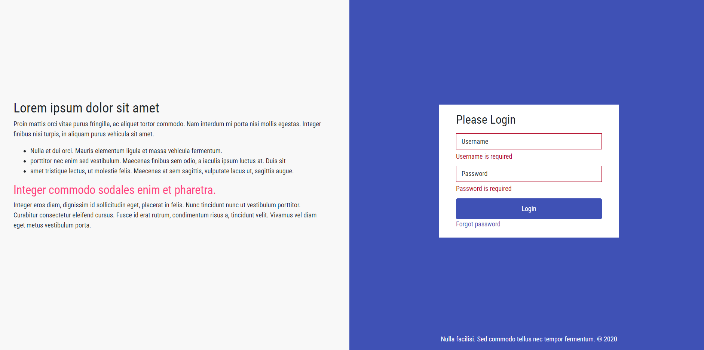

# AppTemplate

This project was generated with [Angular CLI](https://github.com/angular/angular-cli) version 10.2.0.

## Development server

Note: Update the proxy-conf.json with an agileapps instance path.

Run `ng serve` for a dev server. Navigate to `https://localhost:4200/`. The app will automatically reload if you change any of the source files.

## Code scaffolding

Run `ng generate component component-name` to generate a new component. You can also use `ng generate directive|pipe|service|class|guard|interface|enum|module`.

## Build ace-lib theme
run `npm run build:theme` to generate the theme.css file from the theme.scss, available inside `~/src/assets/themes/default` directory.

## Build CUI template
Run `npm run gen:tmpl` generates the cui template for packaging. It compiles the SCSS files used for theming, performs the production build and generates the `templates-details.json`. 

The generated CUI template artefacts will be available in the `./dist/app-template/` directory. You will need to 'zip' this directory before uploading to agileapps platform.
>Note: You might need to remove the *.scss and *.ico files present inside `./dist/app-template/` directory before zipping it, unless you have explicitly white-listed these file extensions in your AgileApps instance. Otherwise, your template installation would fail.

## Running unit tests

Run `ng test` to execute the unit tests via [Karma](https://karma-runner.github.io).

## Running end-to-end tests

Run `ng e2e` to execute the end-to-end tests via [Protractor](http://www.protractortest.org/).

## Further help

To get more help on the Angular CLI use `ng help` or go check out the [Angular CLI Overview and Command Reference](https://angular.io/cli) page.

## Preview:

